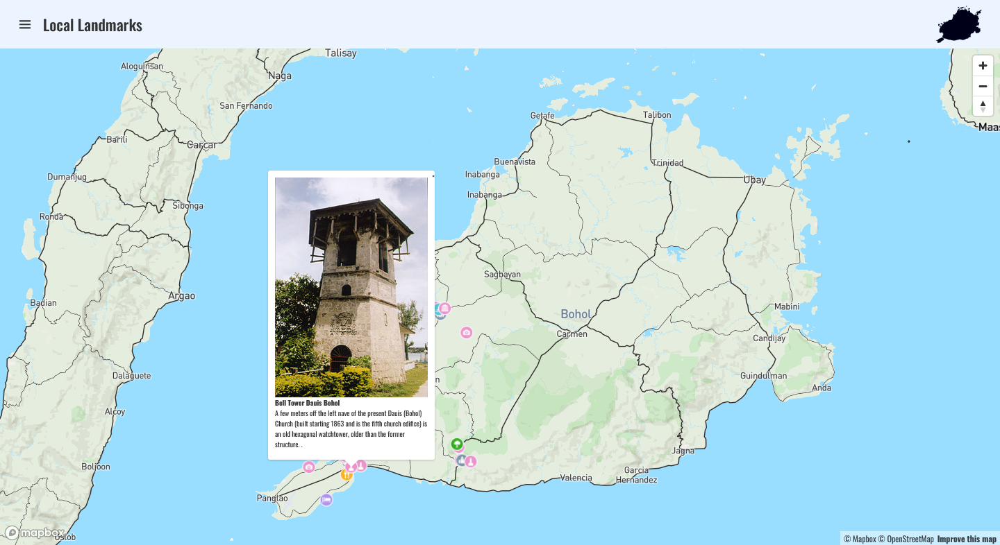

# Local Landmark Web App
http://local-landmark.epizy.com/

<p align="center"><a name="#README-top" href="Images/title-banner-removebg.png">  </a> </p>

This is a web application that allows users to view local landmarks in their town and add custom icons for each landmark. This project was created as a task for a group project.

## Features
* Display a map of Bohol
* Display local Landmarks
* Members of a group can add new landmarks for their town (TBA)
* Custom icons for landmarks can be uploaded and displayed on the map (TBA)

## Technologies Used
* HTML, CSS, and JavaScript for the frontend
* PHP for the backend
* Mapbox API
* Apache HTTP Server
* MySQL Database

## Installation

To run this web app locally, I recommend you to install this applications on your machine. 

* Laragon
* TablePlus 

Once you have those installed, follow these steps:

## Configuring the Web App
* Navigate to the root directory of the Apache local server on Laragon.
* Clone this repository to the root directory.
``` git
git clone https://github.com/Daklit-BISU/Local-Landmark.git
```
## Setting up the Database
* Open TablePlus, Click on the "+" button at the top left corner of the window to create a new database connection.
* Select the type of database you want to connect to (MySQL, PostgreSQL, SQLite, etc.) and enter the necessary information such as host, port, username, and password.
* Execute a query, click on the "Query" button at the top of the table window and enter your SQL command.

```sql
--Create database
CREATE SCHEMA IF NOT EXISTS `heritagesite` DEFAULT CHARACTER SET utf8mb4 COLLATE utf8mb4_0900_ai_ci ;
USE `heritagesite` ;

--Create table
CREATE TABLE IF NOT EXISTS `heritagesite`.`map_heritage` (
  `id` INT NOT NULL AUTO_INCREMENT,
  `type` VARCHAR(10) NOT NULL,
  `property_description_title` TEXT NOT NULL,
  `property_description_content` TEXT NOT NULL,
  `property_description_sub_content` TEXT NOT NULL,
  `property_link_href` TEXT NOT NULL,
  `property_link_label` TEXT NOT NULL,
  `property_icon` TEXT NOT NULL,
  `geometry_type` VARCHAR(50) NOT NULL,
  `coordinate_y` VARCHAR(50) NOT NULL,
  `coordinate_x` VARCHAR(50) NOT NULL,
  `img_src` TEXT NOT NULL,
  PRIMARY KEY (`id`))
ENGINE = InnoDB
AUTO_INCREMENT = 0
DEFAULT CHARACTER SET = utf8mb4;
```

```sql
--add Data
INSERT INTO `map_heritage` (`type`, `property_description_title`, `property_description_content`, `property_description_sub_content`, `property_link_href`, `property_link_label`, `property_icon`, `geometry_type`, `coordinate_y`, `coordinate_x`, `img_src`) VALUES(
'Feature', 
'Hinagdanan Cave (Bingag, Dauis, Bohol)',
'Hinagdanan Cave, meaning ', 
' in Cebuano and it was discovered by a farmer; while clearing his land he found 2 holes, curious, he dropped a stone and heard a splash. He built a ladder “hagdan” and was able to access the cave and find its hidden beauty, thus the origin of the name Hinagdanan.',
'http://www.boholtourismph.com/hinagdanan-cave/',
'“Laddered”',
'attraction',
'Point',
'9.625450', 
'123.800908', 
'https://gttp.imgix.net/330432/x/0/swim-with-your-friends-at-hinagdanan-cave-in-bohol.jpg?ar=1.91%3A1&w=1200&fit=crop');

-- Commit the changes to the database
COMMIT;
```

## Usage

The app displays a map of your town with icons representing local landmarks. To add a custom icon, follow these steps:

* TBA

## Contributing

If you'd like to contribute to this project, feel free to submit a pull request with your changes. Please make sure your code is well-documented and adheres to the project's coding conventions.

## License

This project is licensed under the MIT License - see the LICENSE file for details.

<p align="right">(<a href="#README-top">back to top</a>)</p>

<p align="right">(<a href="#README-top">back to top</a>)</p>